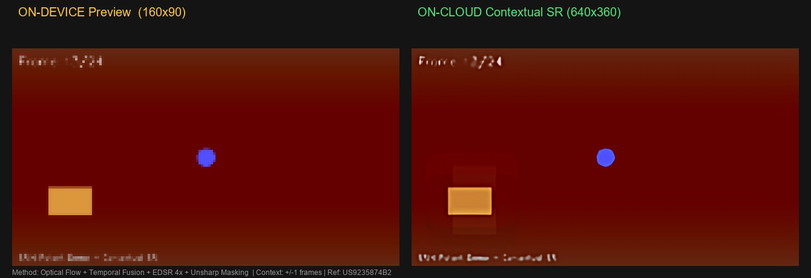

# Contextual Video Upscaling (US9235874B2)

Hybrid AI Pipeline for Video Super-Resolution  
On-Device Preview → Cloud Contextual Processing → High-Resolution Output

This project demonstrates a **contextual video super-resolution pipeline** inspired by **US9235874B2**, where neighboring frames provide additional visual information for reconstructing higher-resolution video.

The system simulates a **hybrid AI architecture**:

- 📱 On-device: lightweight preview generation and privacy gating
- ☁️ Cloud: contextual video super-resolution
- 📱 On-device: verification and video reconstruction

The pipeline shows how **temporal information in video** can be used to improve upscaling quality beyond traditional single-frame methods.

---

## Demo Pipeline



Left: On-device preview (160×90)  
Right: Contextual super-resolution output (640×360)

---

## Key Idea

A single frame contains limited information.

However, **neighboring frames capture the same scene from slightly different temporal positions**.

By detecting motion between frames using **optical flow**, we can:

1. Align neighboring frames
2. Borrow high-frequency detail
3. Fuse frames temporally
4. Upscale the enriched frame

This reduces flicker and increases detail compared to single-frame upscaling.

---

## Architecture
```
Device
│
│ Step 1: Low-res preview (GIF)
▼
User Confirmation
│
│ Step 2: Frame anonymization + integrity tokens
▼
Cloud Processing
│
│ Optical Flow Motion Estimation
│ Frame Alignment (Warping)
│ Temporal Detail Fusion
│ CNN Upscaling (EDSR)
│ Sharpening
▼
Device
│
│ Step 4: Frame verification
│ Step 5: Video reconstruction
▼
High-Resolution Video

---

## Processing Pipeline

| Step | Location | Description |
|-----|-----|-----|
| 0 | Input | Load or generate video frames |
| 1 | On-Device | Generate low-resolution preview GIF |
| 2 | On-Device | Prepare anonymized frames for cloud |
| 3 | Cloud | Optical flow + temporal fusion + CNN upscaling |
| 4 | On-Device | Verify frame integrity |
| 5 | Output | Assemble final high-resolution video |

---

## Example Outputs

### Low-Resolution Device Preview


### Final High-Resolution Video

`step4_final_video.mp4`

---

## Core Technologies

- Python
- OpenCV
- Optical Flow (Farneback)
- Temporal Frame Fusion
- EDSR Super-Resolution Network
- Hybrid Edge-Cloud Processing

---

## Algorithm Overview

### 1. Motion Estimation

Dense optical flow estimates pixel movement between frames.
flow = cv2.calcOpticalFlowFarneback(frame_a, frame_b)

---

### 2. Frame Alignment

Neighbor frames are warped using the flow field.
aligned = cv2.remap(neighbor_frame, flow_map)

---

### 3. Temporal Detail Fusion

Pixels from aligned neighbors are blended using reliability weighting.
fused = weighted_average(current_frame + neighbors)

Static areas receive more detail; moving areas receive less.

---

### 4. Super-Resolution

The fused frame is upscaled using the **EDSR deep CNN**.
sr.upsample(frame)

---

### 5. Post-Processing

Unsharp masking restores crisp edges.

---

## Installation

Requirements:

- Python 3.9+
- OpenCV (contrib)
- NumPy
- Pillow
- Requests

Install dependencies:
pip uninstall opencv-python -y
pip install opencv-contrib-python pillow numpy requests

---

## Running the Demo

### Auto-Generated Demo Video
python contextual_video_upscaling_demo.py --demo

---

### Use Your Own Video
python contextual_video_upscaling_demo.py --input video.mp4

---

### Use an Image
python contextual_video_upscaling_demo.py --input image.jpg

---

### Adjust Quality

Higher context radius uses more neighboring frames.
python contextual_video_upscaling_demo.py --radius 2

Lower scale for faster tests.
python contextual_video_upscaling_demo.py --scale 2

---

## Output Files

| File | Description |
|-----|-----|
| `step1_lowres_preview.gif` | Device preview |
| `step2_cloud_frames/` | Frames prepared for cloud |
| `step3_upscaled_frames/` | Contextually upscaled frames |
| `step4_final_video.mp4` | Final reconstructed video |
| `pipeline_comparison.jpg` | Before vs after comparison |

---

## Reference

This demo is inspired by the contextual video processing method described in:

US9235874B2  
Image Processor for Upscaling and Denoising Using Contextual Video Information

---

## Research Motivation

This prototype explores how **hybrid edge-cloud AI pipelines** can:

- reduce device compute requirements
- protect user privacy
- improve video quality using temporal information
- enable scalable AI video generation systems

Such architectures are relevant for:

- mobile video generation
- streaming platforms
- AR/VR video pipelines
- cloud rendering systems

---

## Repository Structure
```
US9235874B2-contextual-video
│
├── contextual_video_upscaling_demo.py
├── Contextual_Video_Upscaling_Documentation.docx
│
├── pipeline_comparison.jpg
├── step1_lowres_preview.gif
├── step4_final_video.mp4
│
└── README.md

---

## Author

Iqbal Mauludi  
AI Systems / Video Processing / Hybrid Edge-Cloud Architecture
